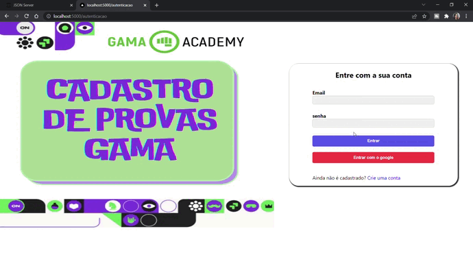
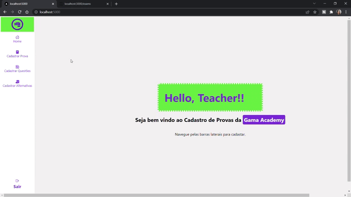
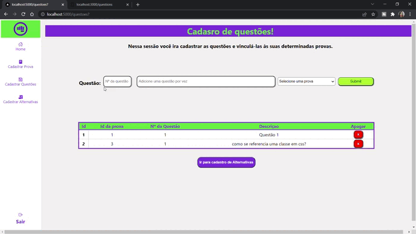
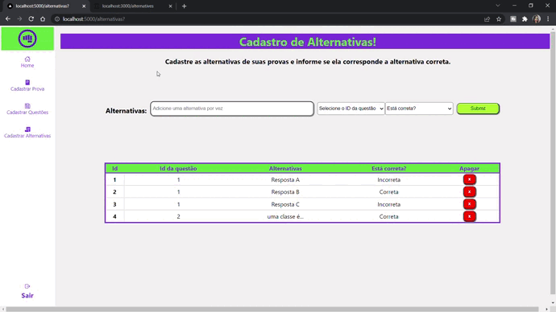

  

Projeto Cadastro de provas - Gama Academy

 

 

 

## ✅ Objetivo

Esse projeto foi proposto como desafio front end da Gama Academy.

O teste consiste em criar o frontend para cadastro de provas com o backend já pronto e disponibilizado através do json-server.

Nesse cadastro deve ser possível incluir uma quantidade ilimitada de provas, de questões para cada prova e de alternativas pra cada questão, onde as mesmas se corelacionam através dos respoctivos Id's. 

Os citérios de visualização para cada item segue as especificações abaixo:

- Provas:
  - Campos:
    - Título
- Questões:
  - Campos:
    - Descrição
    - Número da questão
- Alternativas:
  - Campos:
    - Descrição
    - Alternativa correta?
    

Para construir esse projeto optei por criar um sistema privado para uso exclusivo do professores, onde esses professores devem se cadastrar e entrar com seu login e senha para conseguir incluir as provas no sistema.

 

## ✅ Demonstração do funcionamento

 

### Sistema de autenticação

Para acessar o sistema deve-se cadastar um login e senha ou entrar com uma conta google. Caso o usuário já possua cadastro é só entrar no sistema normalamente.
As rotas do sistema são protegidas, então só é possível acessar qualquer funcionalidade interna se o usuário estiver logado. (veja as possibilidades no gif abaixo)
<h3 align="center"> 
  
</h3>

 

###  Cadastro das provas

Para iniciar os cadastros o usuário deve clicar em uma das opções da barra lateral e logo será direcionado para o a área de cadatro correspondente, podendo iniciar pela área de provas. (Conforme mostrado no gif abaixo)
<h3 align="center"> 
  
</h3>

 

### Cadastro de questãoes

Essa sessão é muito parecida com a anterior, porém nela é possível escolher para qual prova a questão está sendo cadastrada através do Id da mesma.
Na tabela de visualozação podemos ver a relação entre prova e questão. (Segue gif para visualização)
<h3 align="center"> 
  
</h3>

 

### Cadastro de Alternativas

Essa sessão segue a mesma linha das anteriores, porém com mais opções de escolha, onde teremos que informar a qual questão essa alternativa pertence e se ela está correta ou não. (Segue gif para visualização)
<h3 align="center"> 
  
</h3>

 

### Exclusão

Também é possível excluir todas as opções de cadastro (provas, questões e alternativas) caso não sejam mais necessárias. (Segue gif para visualização)
<h3 align="center"> 
  
</h3>

 

## 🛠 Tecnologias Utilizadas

  <table>
    

        <tr>
        <td ></img>
         <td></img>
        </td>
        <td ></img>
         </td>
          </td>
        <td ></img>
        </td>
        </tr>
    

</table>

- Reactjs
- TypeScript
- Nextjs
- Bibliotecas p/ estilização: Styled components e React-icons

 

## 🛠 Para rodar essa aplicação

- Clone esse repositório;
- Baixe as dependências com o segunte comando ` npm install next` ou `yarn add next` de acordo com sua prefêrencia;
- Execute o seguinte comanado para acessar a API no localhost:3000: `npx json-server https://gist.githubusercontent.com/rferro/0b07663deae6a4a4d35170682a8b1fa3/raw/fc8168d1ccbb9f7e6c280de4d4fcaa0c19c3e6a0/db.json` ;
- Mude a porta padrão do React para evitar conflitos com a porta da API utilizando o seguinte comando `export PORT=5000` ;
- Execute o projeto com `npm run dev` .

Entre em contato no email "agatha.lima01@hotmail.com" para qualquer  dúvida técnica.

## ✅ Autora

<table>
  

    <tr>
      <td align="center"><a href="https://github.com/AgathaLima"> <b>Ágatha Lima - Software Developer</b></a> <a href="https://github.com/AgathaLima">🧑‍💻</a>
      </td>
    </tr>
  

</table>
